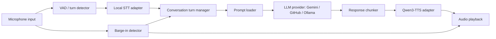

# Specification: CLI Voice Conversation

Last updated: 2026-07-09

## 1. Purpose

Transform the existing functional agentic chat CLI into a local-first AI voice conversation application.

The first target experience stays in the CLI so the audio loop can be developed, profiled, and stabilized before any frontend work. The final conversation mode must feel real time: the user speaks naturally, the app transcribes locally, the LLM/agent responds, Qwen3-TTS speaks the answer, and the user can interrupt the assistant while it is speaking.

## 2. Current Application Baseline

The current app is a TypeScript CLI with:

- `chat`: interactive streaming text chat.
- `agent-chat`: persistent agentic chat with tool use and optional document context.
- Provider abstraction via `ILLMProvider`.
- Existing providers: Google Gemini and GitHub Models.
- Agent loop with local tools.
- RAG context builder and LLM judge utilities.
- Persisted sessions.

The voice work should build on this architecture instead of replacing it.

## 3. Decisions Acted

- The initial product remains a CLI experience.
- The target interaction is real-time voice conversation, not batch dictation.
- Barge-in is required: the user can interrupt the assistant while TTS playback is still running.
- Conversation LLM providers remain Gemini and GitHub Models.
- Add Ollama as a new LLM provider.
- STT must run locally.
- TTS must run locally with Qwen3-TTS.
- Qwen3-TTS voice mode: voice design by prompt.
- Hardware target: Razer Blade 16, RTX 4090 Laptop GPU, 16 GB VRAM, 32 GB RAM.
- All application prompts must be centralized in a `prompts/` folder and loaded dynamically by the app.
- First supported conversation languages: French and English.
- Initial language mode: one explicit session language selected through configuration, either French or English.
- Automatic bilingual or mixed-language conversation is a future enhancement, not a Phase 1 requirement.

## 4. Target User Experience

Command target:

```bash
npm run dev -- voice-chat
```

Expected flow:

1. App starts local audio conversation mode.
2. App checks configured STT, TTS, LLM provider, prompts, microphone, and speaker output.
3. User speaks.
4. STT produces partial and final transcripts.
5. Final transcript is sent to the chosen LLM or agent loop.
6. LLM response streams as text.
7. TTS begins speaking as soon as a useful text chunk is available.
8. If the user starts speaking during playback, playback stops immediately and the new utterance becomes the active turn.
9. The CLI displays compact live state: listening, transcribing, thinking, speaking, interrupted, error.

The CLI should preserve a transcript log for debugging, but the primary interaction should be audio.

## 5. Recommended Architecture

Use TypeScript/Node as the orchestrator and keep STT/TTS as replaceable local engine adapters.



Recommended implementation shape:

- `src/audio/`: microphone capture, playback, VAD, interruption.
- `src/speech/stt/`: STT provider interface and Whisper implementations.
- `src/speech/tts/`: TTS provider interface and Qwen3-TTS implementation.
- `src/prompts/`: prompt file loader, interpolation, validation.
- `src/providers/ollama.ts`: Ollama LLM provider.
- `src/commands/voiceChat.ts`: CLI command wiring the full loop.

## 6. Speech-To-Text

Preferred options:

1. `whisper.cpp`
   - Best fit when we want a local executable with minimal runtime coupling.
   - Good Windows story through native binaries/builds.
   - Supports CPU, CUDA, Vulkan, and other backends.
   - Easy to call from Node as a subprocess.

2. `faster-whisper`
   - Best fit if we accept a Python sidecar service.
   - Very good performance and memory behavior with CTranslate2 and INT8/FP16.
   - Better for advanced streaming pipelines if a Python service is acceptable.

Initial recommendation for this project:

- Prototype with `whisper.cpp` first for integration simplicity.
- Keep the adapter interface compatible with `faster-whisper` so we can switch if latency demands it.

Minimum STT features:

- French and English recognition.
- Partial transcript support if available.
- Final transcript event.
- Configurable model path and language hint.
- Session language hint from `VOICE_LANGUAGE`, mapped to the STT backend language setting.
- Silence/turn-end detection.
- Error recovery if STT process exits.

Language handling:

- The first implementation should run each `voice-chat` session in one configured language.
- Supported values: `fr` and `en`.
- `fr` means the app expects mostly French user speech and asks STT, TTS, and LLM prompts to operate in French.
- `en` means the app expects mostly English user speech and asks STT, TTS, and LLM prompts to operate in English.
- Mixed French/English utterances may work depending on the STT model, but should not be guaranteed initially.

## 7. Text-To-Speech

Use Qwen3-TTS locally with voice design prompts.

Qwen3-TTS official options:

- Python package: `qwen-tts`.
- Models: 0.6B and 1.7B families.
- Supported modes include CustomVoice, VoiceDesign, and Base/clone workflows.
- Supports French among the advertised major languages.
- Streaming generation is part of the model family design.

Recommended local path:

- Start with official `qwen-tts` Python service for correctness and access to voice design.
- Evaluate `qwentts.cpp` / GGUF once the baseline works, especially for lower latency and simpler deployment.

Initial model target:

- `Qwen/Qwen3-TTS-12Hz-1.7B-VoiceDesign` if performance is acceptable on the RTX 4090 Laptop GPU.
- Fallback: 0.6B or GGUF quantized path if 1.7B latency is too high.

Minimum TTS features:

- Voice design prompt loaded from `prompts/voice-style.md`.
- French or English output based on `VOICE_LANGUAGE`.
- Streaming or chunked synthesis.
- Playback cancellation within 200 ms when barge-in is detected.
- Stable audio queue with stop/flush semantics.

## 8. Barge-In And Turn Taking

Barge-in is a first-class requirement.

Behavior:

- While assistant audio is playing, microphone input remains active.
- If VAD detects user speech above threshold for a configurable duration, the app:
  1. stops playback;
  2. clears pending TTS chunks;
  3. marks the assistant turn as interrupted;
  4. starts transcribing the user interruption;
  5. sends the new final transcript as the next user turn.

Target latency:

- Playback stop after detected user speech: under 200 ms.
- First visible partial transcript: under 500 ms when backend supports it.
- First assistant audio after final user transcript: target under 2 seconds, with chunked response/TTS.

Implementation notes:

- Echo cancellation may be needed because the microphone can hear the assistant voice.
- First version can use headphones as the recommended dev setup.
- Later versions should consider WebRTC audio processing or OS-level echo cancellation.

## 9. LLM Providers

Existing providers stay:

- Google Gemini.
- GitHub Models.

New provider:

- Ollama.

Ollama integration options:

- Native REST API: `POST /api/chat`, streaming by default.
- OpenAI-compatible endpoint: useful because the existing GitHub provider already uses the OpenAI SDK pattern.
- Tool calling is supported by Ollama, but model-specific reliability must be tested.

Recommendation:

- Implement Ollama using native `/api/chat` first for full local control.
- Add `promptWithTools` support using Ollama tool calling only after plain chat streaming passes.
- Keep provider selection through existing env/config conventions.

Candidate env vars:

```env
LLMTEST_PROVIDER=ollama
OLLAMA_BASE_URL=http://localhost:11434
OLLAMA_MODEL=qwen3:8b
```

## 10. Prompt Centralization

Create a top-level `prompts/` folder. Prompts are editable by the user and reloaded by the app.

Required files:

```text
prompts/
  persona.md
  agent.md
  rag.md
  judge.md
  judge-strict.md
  faithfulness.md
  stt-cleanup.md
  voice-style.md
```

Prompt rules:

- No core behavioral prompt should remain hard-coded in source files.
- Source code may provide fallback defaults only if a prompt file is missing, but missing prompt files should produce a visible warning.
- Prompt files support simple variables with `{{name}}` syntax.
- Variable interpolation must be explicit and safe; unknown variables should fail in debug mode.
- Prompt changes should be picked up without rebuilding TypeScript.
- For long-running `voice-chat`, prompt reload can happen per turn or through a `/reload-prompts` command.

Initial mapping:

- `persona.md`: main assistant personality and conversation behavior.
- `agent.md`: tool-use behavior and final answer rules.
- `rag.md`: document-grounded answer instruction.
- `judge.md`: normal LLM-as-judge prompt.
- `judge-strict.md`: retry prompt for strict JSON judge output.
- `faithfulness.md`: RAG faithfulness judge prompt.
- `stt-cleanup.md`: optional transcript cleanup/correction prompt before LLM turn.
- `voice-style.md`: Qwen3-TTS voice design instruction.

## 11. Configuration

Add configuration for:

```env
VOICE_LANGUAGE=fr

VOICE_STT_PROVIDER=whisper-cpp
VOICE_STT_MODEL_PATH=./models/whisper/ggml-large-v3-turbo.bin

VOICE_TTS_PROVIDER=qwen3-tts
VOICE_TTS_BASE_URL=http://localhost:7861
VOICE_TTS_MODEL=Qwen/Qwen3-TTS-12Hz-1.7B-VoiceDesign

VOICE_SAMPLE_RATE=16000
VOICE_BARGE_IN=true
VOICE_DEBUG_TRANSCRIPT=true
PROMPTS_DIR=./prompts
```

The app should validate config on startup and show actionable errors.

`VOICE_LANGUAGE` is the canonical language setting for the first version. The app maps it internally:

- `fr` -> STT language hint `fr` or `French`, TTS language `French`, prompts instruct the LLM to answer in French.
- `en` -> STT language hint `en` or `English`, TTS language `English`, prompts instruct the LLM to answer in English.

If `VOICE_LANGUAGE` is omitted, default to `fr` for this project.

## 12. CLI Commands

Add:

```bash
llmtest voice-chat
llmtest voice-chat --agent
llmtest voice-check
llmtest prompts check
```

Expected roles:

- `voice-chat`: starts the full audio conversation loop.
- `voice-chat --agent`: starts opt-in agentic voice mode with tool support.
- `voice-check`: verifies microphone, playback, STT backend, TTS backend, and LLM provider.
- `prompts check`: validates all required prompt files and variables.

In-session commands for `voice-chat`:

```text
/exit
/mute
/unmute
/interrupt
/provider <google|github|ollama>
/model <name>
/reload-prompts
/voice-style
/debug on|off
/tools all|none|<a,b,c> (agent mode)
```

## 13. Agent Handoff Context

This document is intended for future coding agents. Agents should treat it as the product source of truth unless the user gives newer instructions.

Repository context:

- Runtime: TypeScript on Node.js.
- CLI framework: `commander` in `src/cli.ts`.
- Terminal UI: Ink/React components under `src/display/`.
- Config loader: `src/config/loader.ts`, currently driven by `.env`, environment variables, and CLI overrides.
- LLM abstraction: `src/providers/ILLMProvider.ts`.
- Existing provider factory: `src/providers/factory.ts`.
- Existing providers: `src/providers/google.ts` and `src/providers/github.ts`.
- Existing chat command: `src/commands/chat.ts`.
- Existing agent chat command: `src/commands/agentChat.ts`.
- Existing agent loop: `src/engine/agentLoop.ts`.
- Existing RAG prompt builder: `src/rag/contextBuilder.ts`.
- Existing judge prompts: `src/evaluation/llmJudge.ts` and `src/rag/faithfulnessJudge.ts`.
- Tests: Jest via `npm test`; TypeScript build via `npm run build`.

Implementation principles:

- Preserve all existing commands unless the user explicitly asks for removal.
- Build the voice system as additive modules, not as a rewrite of the existing chat.
- Keep STT, TTS, audio IO, and LLM providers behind interfaces so each backend can be replaced.
- Keep prompt text in `prompts/`; source code should load, validate, and interpolate prompts rather than owning behavioral wording.
- Make every phase independently buildable and testable.
- Use mocks for Ollama, STT, TTS, and audio playback in automated tests.
- Do not start frontend work in this roadmap. CLI stability comes first.
- Prefer `streamChat` for low-latency spoken answers. Agent/tool support can be added after the basic streaming voice loop works.
- When an implementation choice is uncertain, add a small adapter/prototype first and keep the public app API stable.

Recommended development order:

1. Prompt system. Status: complete.
2. Ollama provider. Status: complete.
3. Audio IO skeleton. Status: complete.
4. STT adapter. Status: complete.
5. TTS adapter. Status: complete.
6. Full real-time voice loop. Status: complete.
7. Agentic voice mode. Status: complete.

Do not skip directly to the full loop. Barge-in, streaming, STT, and TTS are easier to debug when each layer has its own command or test harness.

Current roadmap status:

| Phase | Name | Status | Notes |
| --- | --- | --- | --- |
| 0 | Repository Baseline | Complete | See `docs/phase-0-baseline.md`. Build passed after dependency install; tests initially failed because no Jest test files existed. |
| 1 | Prompt System | Complete | See `docs/phase-1-prompt-system.md`. Runtime prompt files, prompt loader, `prompts check`, and prompt-loader tests are in place. |
| 2 | Ollama Provider | Complete | See `docs/phase-2-ollama-provider.md`. `ollama` config, native chat API implementation, streaming parser, model listing, docs, and mocked provider tests are in place. |
| 3 | Audio IO Skeleton | Complete | See `docs/phase-3-audio-io-skeleton.md`. Microphone/playback interfaces, Windows ffmpeg capture adapter, cancellable playback queue, VAD, turn detection, `voice-check`, and audio tests are in place. |
| 4 | STT Integration | Complete | See `docs/phase-4-stt-integration.md`. Whisper adapter, language mapping, transcript events, `voice-check` transcription, and mocked process tests are in place. |
| 5 | Qwen3-TTS Integration | Complete | See `docs/phase-5-qwen3-tts-integration.md`. Qwen3-TTS adapter, voice-style prompt loading, chunking, playback queue integration, `voice-check` synthesis, and mocked service tests are in place. |
| 6 | Full Real-Time Voice Loop | Complete | See `docs/phase-6-full-real-time-voice-loop.md`. `voice-chat`, streaming LLM-to-TTS, barge-in/manual interruption, session transcript logs, latency metrics, and mocked loop tests are in place. |
| 7 | Agentic Voice Mode | Complete | See `docs/phase-7-agentic-voice-mode.md`. `voice-chat --agent`, tool selection, sandboxing, visible tool activity, final-answer speech, prompt-file behavior, and mocked tool tests are in place. |

## 14. Development Phases

### Phase 0: Repository Baseline

Status: Complete. See `docs/phase-0-baseline.md`.

Goal:

- Establish that the current app builds and tests before voice work begins.

Likely files touched:

- None, unless baseline commands reveal a small compatibility issue.

Tasks:

- Run `npm run build`.
- Run `npm test`.
- Read `src/cli.ts`, `src/types.ts`, `src/config/loader.ts`, `src/providers/ILLMProvider.ts`, `src/commands/chat.ts`, and `src/commands/agentChat.ts`.
- Record any pre-existing failing tests or build issues before making changes.

Acceptance:

- The agent knows whether failures are pre-existing.
- No voice work is mixed with unrelated refactors.

### Phase 1: Prompt System

Status: Complete. See `docs/phase-1-prompt-system.md`.

Goal:

- Move all reusable behavioral prompts into editable files under `prompts/`.

Likely files touched or created:

- `prompts/persona.md`
- `prompts/agent.md`
- `prompts/rag.md`
- `prompts/judge.md`
- `prompts/judge-strict.md`
- `prompts/faithfulness.md`
- `prompts/stt-cleanup.md`
- `prompts/voice-style.md`
- `src/prompts/promptLoader.ts`
- `src/prompts/templates.ts` or equivalent prompt registry.
- `src/rag/contextBuilder.ts`
- `src/evaluation/llmJudge.ts`
- `src/rag/faithfulnessJudge.ts`
- `src/cli.ts` for `prompts check` command wiring.
- Tests under `tests/` for prompt loading and interpolation.

Tasks:

- Create default prompt files with the current behavior preserved as closely as possible.
- Implement a prompt loader that resolves `PROMPTS_DIR`, defaults to `./prompts`, reads files at runtime, and supports `{{variable}}` interpolation.
- Add validation for required prompt files and required variables.
- Replace hard-coded RAG and judge prompt strings with prompt file loading.
- Add a `prompts check` command that validates prompt existence and variables without calling an LLM.
- Keep fallback prompt strings only as emergency defaults with visible warnings.

Acceptance:

- Editing a prompt file changes behavior without rebuilding TypeScript.
- `prompts check` succeeds with the default prompt folder.
- Existing RAG and judge behavior is functionally preserved.
- `npm run build` and `npm test` pass, or failures are documented if pre-existing.

### Phase 2: Ollama Provider

Status: Complete. See `docs/phase-2-ollama-provider.md`.

Goal:

- Add Ollama as a first-class LLM provider beside Google and GitHub.

Likely files touched or created:

- `src/types.ts`
- `src/config/loader.ts`
- `src/providers/factory.ts`
- `src/providers/ollama.ts`
- `.env.example`
- `README.md`
- Provider tests under `tests/`.

Tasks:

- Extend `AppConfig["provider"]` to include `ollama`.
- Add `OLLAMA_BASE_URL` and `OLLAMA_MODEL` config support.
- Implement `prompt`, `chat`, and `streamChat` using Ollama's native chat API.
- Parse Ollama streaming responses incrementally and call the existing `onChunk` callback.
- Map internal roles: `model` -> `assistant`, `user` -> `user`.
- Implement `listModels` using Ollama's local model listing endpoint if available.
- Do not require an API key for Ollama.
- Add mocked HTTP tests for success, streaming, and error responses.

Acceptance:

- `LLMTEST_PROVIDER=ollama npm run dev -- chat` can use a local Ollama model.
- Streaming responses render through the existing chat UI.
- Google and GitHub providers still work.
- `npm run build` and `npm test` pass, or failures are documented if pre-existing.

### Phase 3: Audio IO Skeleton

Status: Complete. See `docs/phase-3-audio-io-skeleton.md`.

Goal:

- Establish reliable microphone input, playback output, cancellation, and basic VAD in the CLI before STT/TTS are added.

Likely files touched or created:

- `src/audio/types.ts`
- `src/audio/microphone.ts`
- `src/audio/player.ts`
- `src/audio/vad.ts`
- `src/audio/turnDetector.ts`
- `src/commands/voiceCheck.ts`
- `src/cli.ts`
- Audio state-machine tests under `tests/`.

Tasks:

- Define interfaces for microphone capture, playback, VAD events, and cancellation.
- Add `voice-check` to verify available microphone and speaker output.
- Record a short utterance to a temporary WAV/PCM buffer.
- Play a known test tone or test WAV.
- Implement a cancellable playback queue with `play`, `stop`, and `flush`.
- Implement a first VAD/turn detector with configurable thresholds.
- Keep the audio package choice isolated behind `src/audio/` interfaces.

Acceptance:

- `llmtest voice-check` can record a short sample and play audio back.
- Playback can be stopped programmatically in under 200 ms in a local test.
- Audio state-machine tests cover idle, listening, speaking, interrupted, and error states.
- `npm run build` and `npm test` pass, or failures are documented if pre-existing.

### Phase 4: STT Integration

Status: Complete. See `docs/phase-4-stt-integration.md`.

Goal:

- Convert local speech into final transcripts using a replaceable Whisper adapter.

Likely files touched or created:

- `src/speech/stt/ISTTProvider.ts`
- `src/speech/stt/whisperCpp.ts`
- `src/speech/stt/factory.ts`
- `src/speech/stt/types.ts`
- `src/config/loader.ts`
- `src/commands/voiceCheck.ts`
- STT adapter tests under `tests/`.

Tasks:

- Define transcript events: `partial`, `final`, `error`, and `end`.
- Implement a `whisper.cpp` adapter that can transcribe a recorded utterance.
- Map `VOICE_LANGUAGE=fr|en` to the backend language flag.
- Support configurable `VOICE_STT_MODEL_PATH`.
- Surface clear errors for missing binary, missing model, unsupported language, and failed process exit.
- Keep the interface compatible with a later `faster-whisper` adapter.
- Add mocked process tests for transcript parsing and error handling.

Acceptance:

- `voice-check` can record speech and print a local transcript.
- French and English sessions can be selected through `VOICE_LANGUAGE`.
- STT failures do not crash the whole CLI without an actionable message.
- `npm run build` and `npm test` pass, or failures are documented if pre-existing.

### Phase 5: Qwen3-TTS Integration

Status: Complete. See `docs/phase-5-qwen3-tts-integration.md`.

Goal:

- Convert assistant text into local speech using Qwen3-TTS with voice design prompts.

Likely files touched or created:

- `src/speech/tts/ITTSProvider.ts`
- `src/speech/tts/qwen3Tts.ts`
- `src/speech/tts/factory.ts`
- `src/speech/tts/types.ts`
- `src/audio/player.ts`
- `src/prompts/promptLoader.ts`
- `src/config/loader.ts`
- `src/commands/voiceCheck.ts`
- TTS adapter tests under `tests/`.

Tasks:

- Define TTS methods for full synthesis and chunked/streaming synthesis if the backend supports it.
- Call the local Qwen3-TTS service through `VOICE_TTS_BASE_URL`.
- Load voice design instructions from `prompts/voice-style.md`.
- Map `VOICE_LANGUAGE=fr|en` to the TTS language expected by Qwen3-TTS.
- Add text chunking rules so long model responses can begin playback before the full answer is complete.
- Wire synthesized audio into the cancellable playback queue.
- Add mocked service tests for successful synthesis, backend errors, timeout, and cancellation.

Acceptance:

- `voice-check` can synthesize and play a short French or English test sentence.
- Changing `prompts/voice-style.md` changes the voice design instruction sent to TTS.
- Playback can be interrupted while generated audio is queued.
- `npm run build` and `npm test` pass, or failures are documented if pre-existing.

### Phase 6: Full Real-Time Voice Loop

Status: Complete. See `docs/phase-6-full-real-time-voice-loop.md`.

Goal:

- Deliver the first usable CLI voice conversation loop with real-time turn taking and barge-in.

Likely files touched or created:

- `src/commands/voiceChat.ts`
- `src/audio/conversationState.ts`
- `src/audio/interruptController.ts`
- `src/speech/stt/*`
- `src/speech/tts/*`
- `src/prompts/*`
- `src/session/session.ts`
- `src/display/components/VoiceChatInterface.tsx` if Ink UI is useful.
- `src/cli.ts`
- Integration tests with mocked STT, TTS, and LLM streams.

Tasks:

- Add `voice-chat` command.
- Start in one configured language from `VOICE_LANGUAGE`.
- Use `streamChat` for the first voice loop so TTS can start before the full answer is complete.
- Keep the microphone active while the assistant speaks.
- On barge-in, stop playback, clear queued TTS, mark the assistant message as interrupted, and begin transcribing the user interruption.
- Save transcript/session logs for debugging.
- Add in-session commands: `/exit`, `/mute`, `/unmute`, `/interrupt`, `/provider`, `/model`, `/reload-prompts`, `/voice-style`, `/debug`.
- Route through the plain chat provider first. Add `--agent` or agent-loop integration only after the base streaming loop is stable.
- Log latency metrics: STT final, LLM first token, TTS first audio, playback stop, and end-to-end turn time.

Acceptance:

- A user can hold a natural French conversation from the CLI.
- A user can switch to English with `VOICE_LANGUAGE=en`.
- Assistant audio starts before the full model response is complete when streaming is available.
- User speech during assistant playback interrupts audio and becomes the next turn.
- The loop recovers from one failed STT or TTS call without losing the whole session.
- `npm run build` and `npm test` pass, or failures are documented if pre-existing.

### Phase 7: Agentic Voice Mode

Status: Complete. See `docs/phase-7-agentic-voice-mode.md`.

Goal:

- Add agent/tool support to voice conversation after the base voice loop is stable.

Likely files touched or created:

- `src/commands/voiceChat.ts`
- `src/engine/agentLoop.ts`
- `src/prompts/agent.md`
- `src/display/components/VoiceChatInterface.tsx`
- Integration tests with mocked tools.

Tasks:

- Add `voice-chat --agent` or equivalent opt-in mode.
- Reuse existing tool registration from `src/providers/tools/`.
- Make tool activity visible in the CLI without overwhelming the audio experience.
- Decide whether agent mode speaks only final answers or also brief tool-progress messages.
- Keep prompt and persona behavior loaded from prompt files.

Acceptance:

- Voice chat can answer with tool use when agent mode is enabled.
- Plain low-latency voice chat still works when agent mode is disabled.
- Tool errors are spoken or displayed in a user-friendly way.

## 15. Testing Strategy

Every implementation phase should finish with:

- `npm run build`
- `npm test`

Automated tests:

- Prompt loader unit tests.
- Provider tests with mocked Ollama API.
- Audio state-machine tests: listening, speaking, interrupted, recovering.
- TTS queue tests: enqueue, stop, flush.
- Transcript cleanup tests.
- Mocked STT/TTS/audio tests rather than requiring microphone, speaker, Whisper, or Qwen3-TTS in CI.

Manual test scripts:

- French short utterance.
- French long utterance.
- English utterance.
- Interrupt assistant mid-sentence.
- Switch provider during a session.
- Reload `voice-style.md` and confirm new voice instruction is used.

Performance metrics to log:

- STT final latency.
- LLM first-token latency.
- TTS first-audio latency.
- Playback stop latency on barge-in.
- End-to-end turn latency.

## 16. Risks

- Qwen3-TTS 1.7B VoiceDesign may be too slow for very fluid real-time playback, even on 16 GB VRAM.
- Echo from speakers may trigger false barge-in; headphones may be required during development.
- Ollama tool calling varies by local model; plain chat should land before agentic tool support.
- Streaming TTS integration may require service-side work if the chosen Qwen runtime only produces full WAV files.
- Windows audio device handling can be brittle; isolate audio IO behind a small interface.

## 17. References

- Qwen3-TTS official repository: https://github.com/QwenLM/Qwen3-TTS
- Qwen3-TTS GGUF model card: https://huggingface.co/Serveurperso/Qwen3-TTS-GGUF
- qwentts.cpp: https://github.com/ServeurpersoCom/qwentts.cpp
- OpenAI Whisper: https://github.com/openai/whisper
- whisper.cpp: https://github.com/ggml-org/whisper.cpp
- faster-whisper: https://github.com/SYSTRAN/faster-whisper
- Ollama chat API: https://docs.ollama.com/api/chat
- Ollama streaming: https://docs.ollama.com/capabilities/streaming
- Ollama tool calling: https://docs.ollama.com/capabilities/tool-calling
- Ollama OpenAI compatibility: https://docs.ollama.com/api/openai-compatibility
